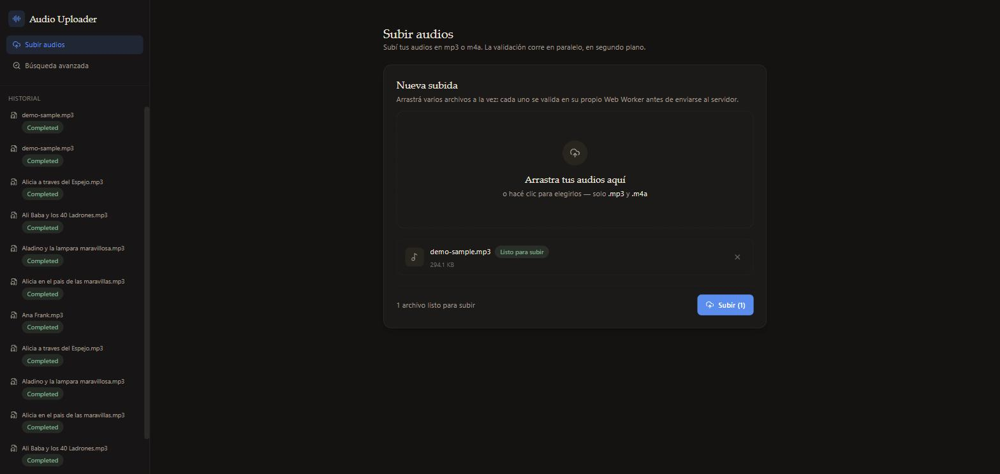
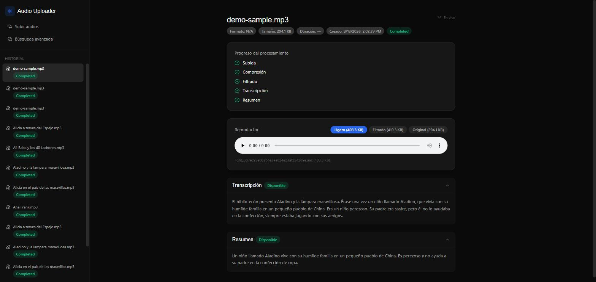
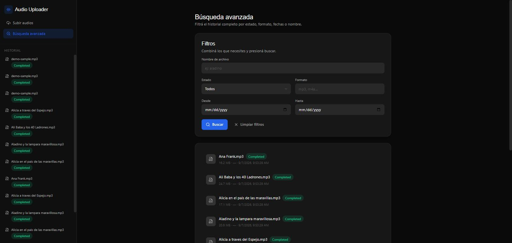
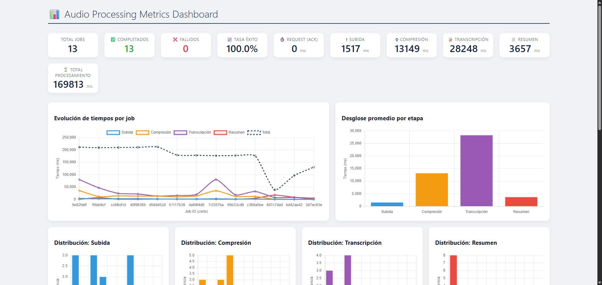

# Sonata

**Sonata** es una plataforma para subir archivos de audio y procesarlos automáticamente: los comprime, les aplica filtros de mejora, los transcribe con IA y genera un resumen del contenido. Proyecto académico (Capstone), pensado como monorepo que agrupa el backend, el frontend y la infraestructura de despliegue.

```
Audio subido  →  Compresión + Filtrado (FFmpeg)  →  Transcripción (Whisper)  →  Resumen (LLM)  →  Resultado disponible por API / UI / WebSocket
```

---

## Tabla de contenidos

- [Capturas](#capturas)
- [Alcance](#alcance)
- [Arquitectura](#arquitectura)
- [Estructura del monorepo](#estructura-del-monorepo)
- [Stack tecnológico](#stack-tecnológico)
- [Cómo correr el proyecto](#cómo-correr-el-proyecto)
- [Variables de entorno](#variables-de-entorno)
- [API](#api)
- [Pruebas de carga](#pruebas-de-carga)
- [Estado y limitaciones conocidas](#estado-y-limitaciones-conocidas)

---

## Capturas

Imágenes construidas **desde cero a partir del código fuente de este monorepo** (`docker build` sobre `AudioUploader/Dockerfile` y `frontend/Dockerfile`, sin usar las imágenes publicadas en el registry) y corridas con `docker compose` (backend, frontend, PostgreSQL, MinIO, RabbitMQ y Ollama con GPU). Probado subiendo un audio real de punta a punta.

| | |
|---|---|
| **Subir Audios** — formulario de subida con drag & drop y validación en Web Worker | **Detalle de un Job** — checklist de progreso, versiones Original/Filtrado/Ligero, transcripción y resumen |
|  |  |
| **Búsqueda avanzada** — filtros por nombre, estado, formato y fecha | **Dashboard de métricas** — tiempos por etapa del pipeline |
|  |  |

Construir y correr con las imágenes locales en vez de las del registry:

```bash
docker build -t sonata-audiouploader:local -f AudioUploader/Dockerfile AudioUploader
docker build -t sonata-frontend:local -f frontend/Dockerfile frontend
cd infrastructure
docker compose -f docker-compose.yml -f docker-compose.local.yml up -d
```

> **Sobre la rama de `frontend/`:** este monorepo trackea el código fuente de la rama `feature/laboratory-9-Add-Audio-Filters-Component` del repositorio original de `frontend` (no `main`, que es una versión anterior y más simple, sin búsqueda avanzada, Web Workers ni WebSocket) — es la rama que generó la imagen `:latest` publicada en el registry, y coincide con lo que está desplegado. El backend, en cambio, ya trackeaba correctamente `feature/laboratory-9-Add-Audio-Filters` desde el principio.

---

## Alcance

Sonata permite:

- **Subir** uno o varios archivos de audio vía HTTP (hasta 100 MB por archivo).
- **Almacenar** el original y sus derivados en object storage (MinIO / S3-compatible).
- **Comprimir** el audio a un formato liviano (AAC) para reducir espacio y ancho de banda.
- **Filtrar** el audio (reducción de ruido, normalización) como salida adicional opcional.
- **Transcribir** el contenido hablado usando `faster-whisper` (GPU), en español por defecto.
- **Resumir** la transcripción usando un modelo LLM local servido por Ollama (`llama3.2`).
- **Notificar en tiempo real** el avance de cada etapa vía WebSocket (SignalR).
- **Consultar** el estado, la transcripción y el resumen de cada trabajo por API REST, y listar/filtrar el historial de archivos subidos.
- **Observar** el rendimiento del pipeline (tiempos por etapa, batches, tasa de éxito) desde un dashboard de métricas.

**Fuera de alcance:** autenticación/autorización de usuarios, multi-tenancy, edición de audio, clasificación o análisis de sentimiento del contenido, soporte multi-idioma configurable por request (el idioma de transcripción está fijado por configuración del servidor).

---

## Arquitectura

### Vista de componentes

```
                         ┌──────────────┐
                         │   frontend    │  React + TS + Vite
                         │ (Nginx :80)   │
                         └──────┬───────┘
                                │ HTTP / WebSocket
                                ▼
                    ┌────────────────────────┐
                    │   AudioUploader (API)    │  ASP.NET Core (.NET 10)
                    │  Controllers · SignalR    │
                    │  Hub · Background Workers │
                    └───┬─────────┬────────┬───┘
                        │         │        │
            ┌───────────┘   ┌─────┘        └───────────┐
            ▼               ▼                          ▼
     ┌─────────────┐  ┌───────────┐             ┌──────────────┐
     │ PostgreSQL   │  │  MinIO     │             │  Subprocesos  │
     │ (estado/     │  │ (objetos:  │             │  Python:      │
     │  metadatos)  │  │  audio)    │             │  Whisper /    │
     └─────────────┘  └───────────┘             │  Ollama (HTTP)│
                                                    └──────┬───────┘
                                                           │ resultados
                                                           ▼
                                                    ┌──────────────┐
                                                    │  RabbitMQ     │
                                                    │ (cola de      │
                                                    │  resultados)  │
                                                    └──────────────┘
```

- **`frontend/`** — cliente web (React + TypeScript + Vite + Tailwind) para subir audio, buscar en el historial y ver el estado del procesamiento en tiempo real (SignalR).
- **`AudioUploader/`** — backend (ASP.NET Core / .NET 10), organizado en **Clean Architecture**:
  - `Domain` — entidades y reglas de negocio puras (`Job`, `AudioFile`, `Transcript`, cálculo de estado).
  - `Application` — casos de uso y puertos (interfaces) hacia infraestructura.
  - `Infrastructure` — implementaciones concretas: EF Core/PostgreSQL, MinIO, FFmpeg, Whisper, Ollama, RabbitMQ.
  - `Web` — API HTTP, hub de SignalR, middleware, composición de la aplicación.
- **`infrastructure/`** — Docker Compose con todos los servicios de soporte (PostgreSQL, MinIO, RabbitMQ, Ollama) y pruebas de carga (k6).

### Flujo de procesamiento de un audio

1. El cliente sube el archivo → la API lo guarda temporalmente en disco y responde de inmediato con un `jobId` (estado `Pending`). El archivo se encola para procesamiento en background.
2. En paralelo (sin bloquear al cliente): **subida a MinIO**, **compresión** a AAC y **filtrado** de audio — cada una es una tarea independiente que actualiza el estado del job al terminar.
3. La transcripción y el resumen **no se disparan por archivo individual**: se agrupan en *batches* (tamaño e intervalo configurables) para aprovechar mejor la GPU al cargar el modelo de Whisper/Ollama una sola vez por lote.
4. Un proceso Python (`whisper_transcribe.py` / `summary_generator.py`) ejecuta el batch y publica cada resultado a RabbitMQ apenas termina (no espera a que termine todo el lote).
5. Un *consumer* en el backend recibe cada resultado de la cola, actualiza la base de datos y notifica al cliente conectado por WebSocket en tiempo real.
6. Un job se considera `Completed` cuando se cumplieron las etapas de subida, compresión, transcripción y resumen (el filtrado de audio es un output adicional que no bloquea el resultado final).

### Modelo de concurrencia (resumen)

- Todo el backend es **asíncrono** (`async`/`await` de punta a punta).
- Subida, compresión y filtrado corren en **paralelo real** por job (tareas en background), limitadas por un semáforo configurable.
- Transcripción y resumen se procesan por **lotes** (batching) mediante un timer + cola interna thread-safe, con un *gate* global que evita que ambos compitan por la GPU al mismo tiempo.
- Los resultados vuelven por **RabbitMQ** (cola de mensajes) y se notifican al cliente por **SignalR** (WebSocket).

---

## Estructura del monorepo

```
Sonata/
├── AudioUploader/        # Backend — API .NET 10 (Clean Architecture)
│   └── src/
│       ├── AudioUploader.Domain/
│       ├── AudioUploader.Application/
│       ├── AudioUploader.Infrastructure/
│       ├── AudioUploader.Web/
│       └── scripts/       # whisper_transcribe.py, summary_generator.py
├── frontend/              # Cliente web — React + TypeScript + Vite + Tailwind
│   └── src/
├── infrastructure/        # Docker Compose + pruebas de carga (k6)
│   ├── docker-compose.yml
│   ├── docker-compose.local.yml  # overlay opcional: usa imágenes construidas localmente
│   └── k6/load-test.js
├── docs/screenshots/      # Capturas usadas en este README
├── .gitattributes         # Fuerza LF en scripts (evita romper entrypoint.sh en Linux)
└── README.md              # Este documento
```

---

## Stack tecnológico

| Capa | Tecnología |
|---|---|
| Backend | C# / .NET 10 (ASP.NET Core, Clean Architecture) |
| Base de datos | PostgreSQL 16 + Entity Framework Core (Npgsql) |
| Object storage | MinIO (S3-compatible) |
| Mensajería | RabbitMQ |
| Tiempo real | SignalR (WebSocket) |
| Transcripción | `faster-whisper` (Python, GPU/CUDA) |
| Resumen | Ollama (`llama3.2`, LLM local) |
| Procesamiento de audio | FFmpeg |
| Frontend | React 18 + TypeScript + Vite + Tailwind CSS + Axios + `@microsoft/signalr` |
| Validación de audio (cliente) | Web Workers (validación fuera del hilo principal) |
| Contenedores | Docker / Docker Compose (runtime NVIDIA para GPU) |
| Pruebas de carga | k6 |
| Tests (frontend) | Vitest + Testing Library |

---

## Cómo correr el proyecto

### Requisitos previos

- Docker 20.10+ y Docker Compose 2.0+
- GPU NVIDIA + [NVIDIA Container Toolkit](https://docs.nvidia.com/datacenter/cloud-native/container-toolkit/latest/install-guide.html) (recomendado para Whisper/Ollama; el sistema puede configurarse en CPU pero con rendimiento muy inferior)
- Acceso al Container Registry donde se publiquen las imágenes de `AudioUploader` y `frontend` (o construirlas localmente a partir de los `Dockerfile` de cada proyecto)

### Levantar el entorno completo

```bash
cd infrastructure
cp .env.example .env
# Editá .env con tus credenciales y parámetros (los valores por defecto sirven para probar localmente)

docker compose up -d
docker compose ps   # todos los servicios deberían quedar "healthy"
```

Esto levanta: PostgreSQL, MinIO, RabbitMQ, Ollama (+ `ollama-init`, que descarga el modelo `llama3.2` una sola vez), la API (`AudioUploader`) y el `frontend`.

### Servicios expuestos (valores por defecto)

| Servicio | Puerto | URL |
|---|---|---|
| API (Swagger) | 5247 | `http://localhost:5247/swagger` |
| API (subida) | 5247 | `http://localhost:5247/api/audio` |
| Dashboard de métricas | 5247 | `http://localhost:5247/dashboard.html` |
| Frontend | 80 | `http://localhost:80` |
| MinIO Console | 9001 | `http://localhost:9001` (`minioadmin` / `minioadmin` por defecto) |
| RabbitMQ Management | 15672 | `http://localhost:15672` |
| Ollama API | 11434 | `http://localhost:11434` |
| PostgreSQL | 5432 | `psql -h localhost -p 5432 -U postgres` |

### Desarrollo local (sin Docker)

**Backend** (`AudioUploader/`):
```bash
cd AudioUploader/src/AudioUploader.Web
cp .env.example .env   # completar con tus valores locales (DB, MinIO, RabbitMQ, rutas a ffmpeg/python)
dotnet run
```
Requiere PostgreSQL, MinIO, RabbitMQ y Ollama corriendo (localmente o vía `infrastructure/docker-compose.yml`), además de `ffmpeg` y Python 3 con las dependencias de `AudioUploader/src/scripts/requirements.txt` instaladas.

**Frontend** (`frontend/`):
```bash
cd frontend
npm install
npm run dev
```

---

## Variables de entorno

Cada proyecto trae su propio `.env.example` documentado:

- [`AudioUploader/src/AudioUploader.Web/.env.example`](AudioUploader/src/AudioUploader.Web/.env.example) — configuración de base de datos, MinIO, FFmpeg, Whisper, resumen, batching y RabbitMQ.
- [`infrastructure/.env.example`](infrastructure/.env.example) — mismas variables, orientadas a Docker Compose.
- [`frontend/.env.development`](frontend/.env.development) — URL base de la API consumida por el cliente web.

Variables más relevantes para ajustar el comportamiento del pipeline:

| Variable | Descripción |
|---|---|
| `BATCH_SIZE` | Cantidad de jobs por lote de transcripción/resumen |
| `BATCH_INTERVAL_SECONDS` | Tiempo máximo de espera antes de procesar un lote incompleto |
| `MAX_CONCURRENT_COMPRESSIONS` | Compresiones simultáneas permitidas |
| `WHISPER_MODEL` / `WHISPER_DEVICE` | Modelo y dispositivo (`cuda`/`cpu`) para transcripción |
| `SUMMARY_MODEL` / `OLLAMA_URL` | Modelo y endpoint de Ollama para el resumen |
| `HF_TOKEN` | Token de Hugging Face — **opcional**, solo necesario si el modelo de Whisper que se use es privado/gated en HF |

> **Importante:** nunca commitear archivos `.env` reales — solo `.env.example` con placeholders. Los `.env` están excluidos en `.gitignore`.

---

## API

Endpoints principales expuestos por `AudioUploader` (documentación interactiva completa en `/swagger` en entorno de desarrollo):

| Método | Ruta | Descripción |
|---|---|---|
| `POST` | `/api/audio` | Sube uno o más archivos de audio |
| `GET` | `/api/audio` | Lista archivos subidos, con paginación y filtros |
| `GET` | `/api/audio/{audioId}` | Detalle de un archivo (incluye derivados: comprimido, filtrado) |
| `GET` | `/api/jobs/{jobId}/status` | Estado del procesamiento de un job |
| `GET` | `/api/jobs/{jobId}/transcription` | Texto transcripto |
| `GET` | `/api/jobs/{jobId}/summary` | Resumen generado |
| `GET` | `/api/metrics` | Métricas agregadas del pipeline (para el dashboard) |
| `WS` | `/hubs/audio-processing` | Notificaciones en tiempo real por job (SignalR) |

---

## Pruebas de carga

`infrastructure/k6/load-test.js` simula usuarios subiendo audio y consultando el estado de sus jobs.

```bash
cd infrastructure
k6 run -e BASE_URL="http://localhost:5247" \
       -e TEST_FILE="/ruta/a/tu/audio.mp3" \
       -e WAIT_TIME=2 \
       -e BATCH_SIZE=10 \
       k6/load-test.js
```

---

## Estado y limitaciones conocidas

- Proyecto académico (Capstone) en desarrollo activo.
- **Backend sin tests automatizados** ni pipeline de CI configurado todavía. El frontend sí tiene un test (Vitest) para la validación de audio (`frontend/src/__tests__/audioValidation.test.ts`), pero es el único.
- **No hay autenticación/autorización** en ningún endpoint — pensado para entorno de desarrollo/demo, no para exposición pública sin una capa adicional de seguridad.
- El pipeline de transcripción/resumen depende de GPU NVIDIA para rendimiento aceptable; en CPU funciona pero significativamente más lento.
- El dashboard de métricas (`/dashboard.html`) es una página estática servida por el backend, separada del SPA de React — no está integrado como una vista más de `frontend/`.
